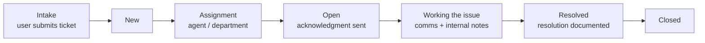

# osTicket — Ticket Lifecycle: Intake Through Resolution

This walkthrough follows a help desk ticket through its full lifecycle in [osTicket](https://osticket.com/), the open-source ticketing system — from the moment a user submits an issue to final resolution and closure. It builds on the environment set up in [osTicket — Prerequisites and Installation](https://github.com/DorseaColwell/osticket-prereqs).

## Environments and Technologies Used

- Microsoft Azure (Virtual Machines / Compute)
- Remote Desktop (RDP)
- Internet Information Services (IIS)
- osTicket

## Operating Systems Used

- Windows 10 21H2

## Ticket Lifecycle at a Glance

## Lifecycle Stages

### 1. Ticket Creation (Intake)

A user submits a new ticket through the client portal or via email. osTicket assigns a unique ticket ID and sets the status to **New**. Help topics (e.g., *Business Critical Outage* vs. *Personal Computer Issues*) route the ticket and set its initial priority.

### 2. Assignment and Initial Response

An agent reviews the incoming ticket, sets its **priority** and **SLA** based on impact, and assigns it to the appropriate department or individual. The status changes to **Open**, and an acknowledgment is sent to the user confirming receipt.

### 3. Working the Issue

The assigned agent investigates, communicating with the user through the ticket thread when more information is needed. All correspondence and internal notes are documented on the ticket, so any agent can pick up the full history. Throughout this stage the ticket remains **Open**.

### 4. Resolution and Closure

Once the issue is fixed, the agent documents the resolution details on the ticket and sets the status to **Resolved**; the user is notified with the resolution information. After user acknowledgment or a predefined waiting period, the ticket is marked **Closed** — preserving a searchable record for future incidents and knowledge-base articles.

## Takeaways

Working tickets end-to-end in osTicket exercises the fundamentals of real help desk operations: triage and prioritization by business impact, SLA awareness, clear user communication, and disciplined documentation from intake to closure.
