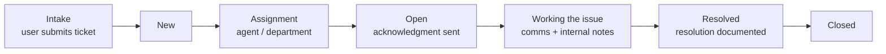
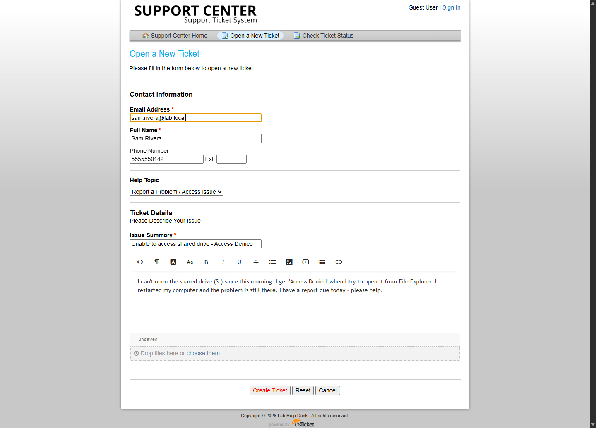
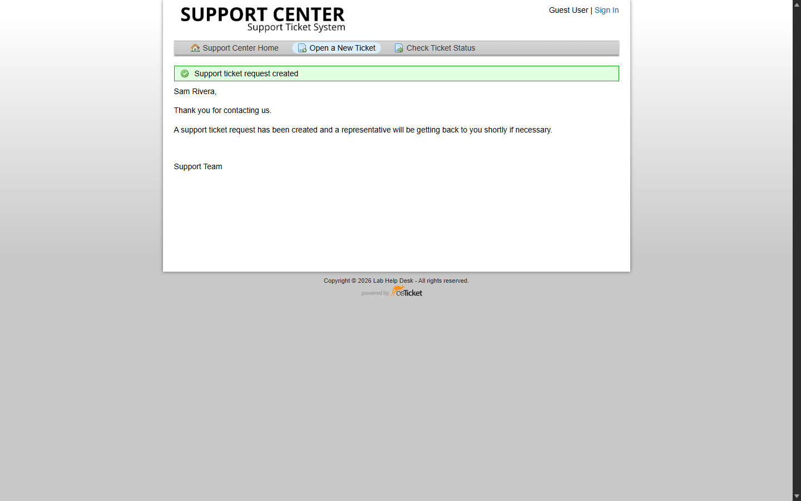
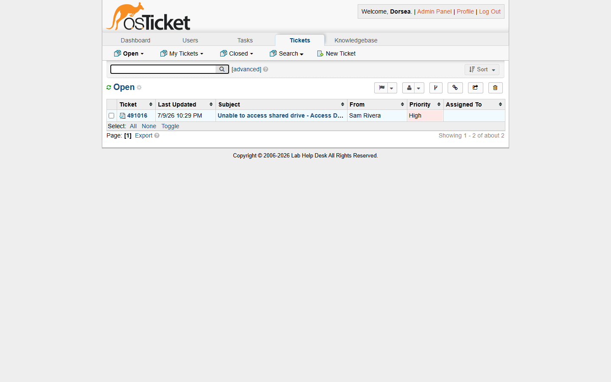
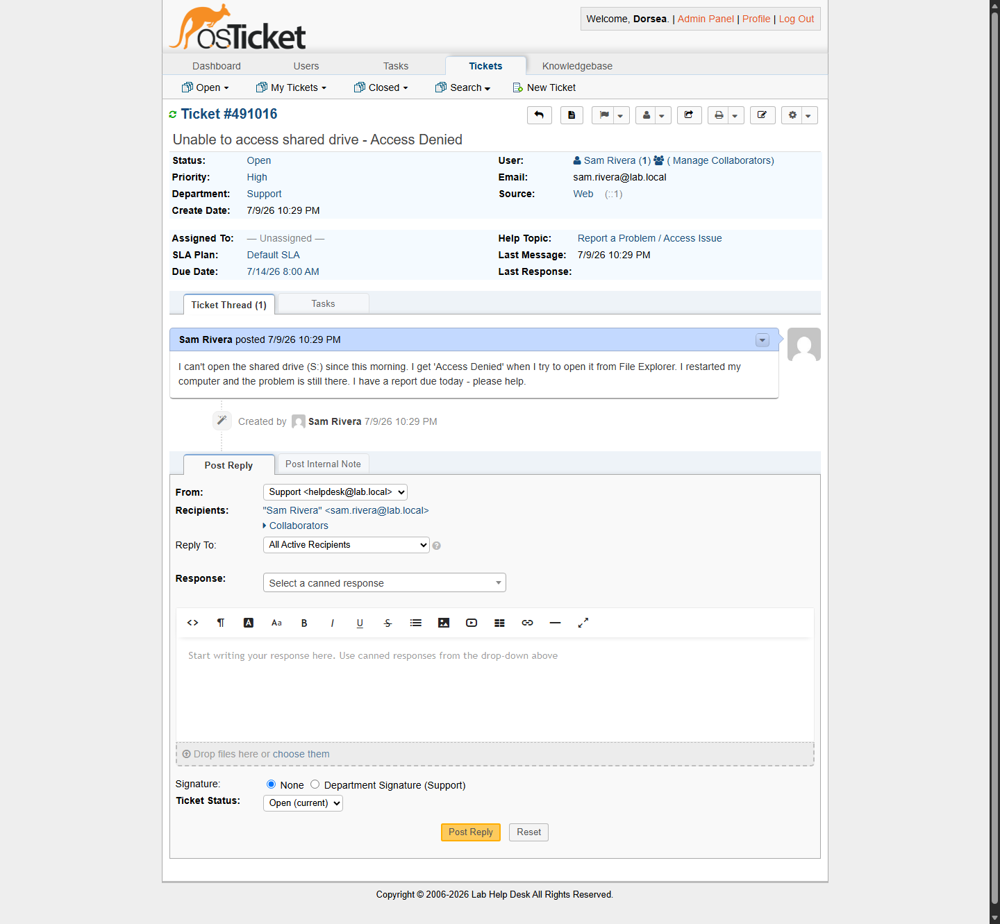
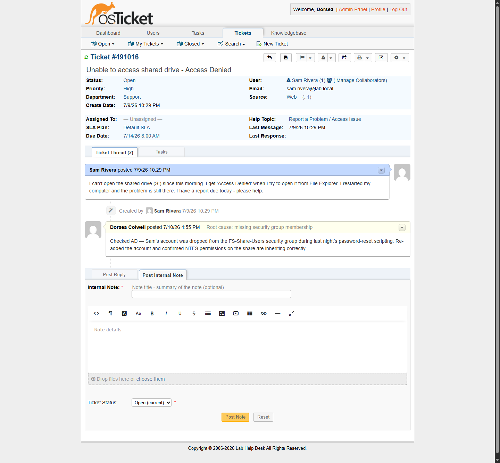
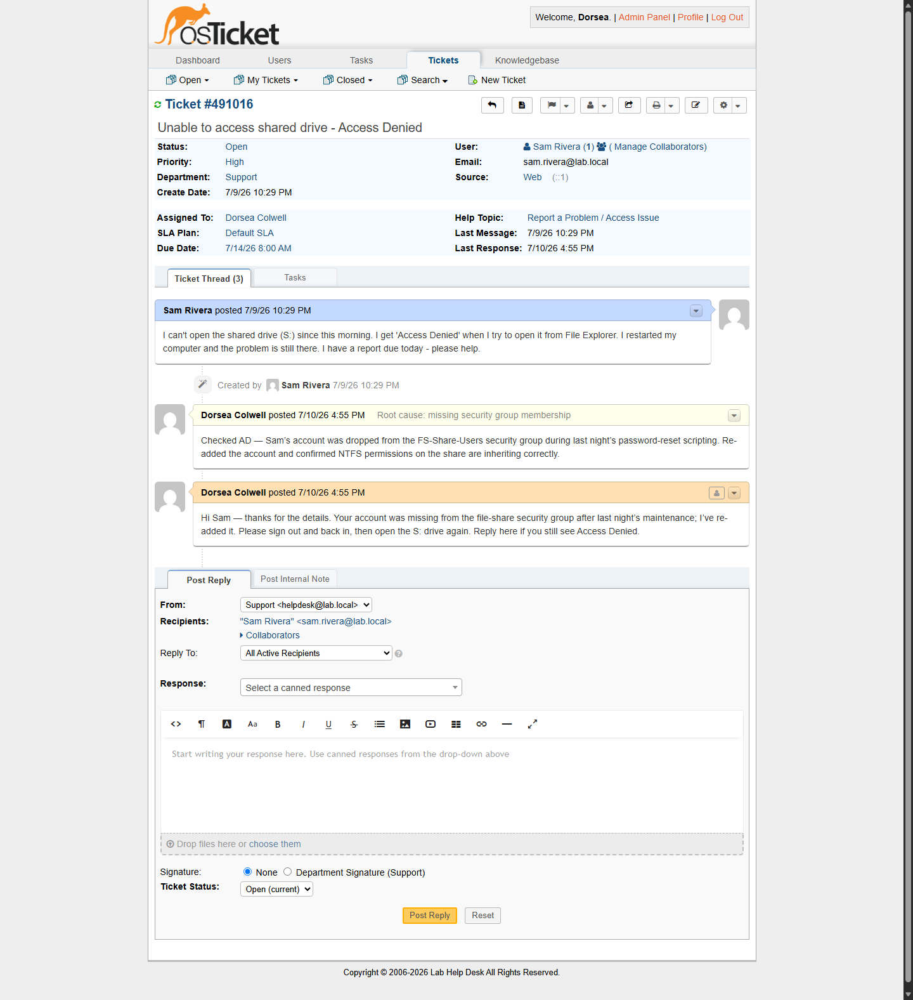
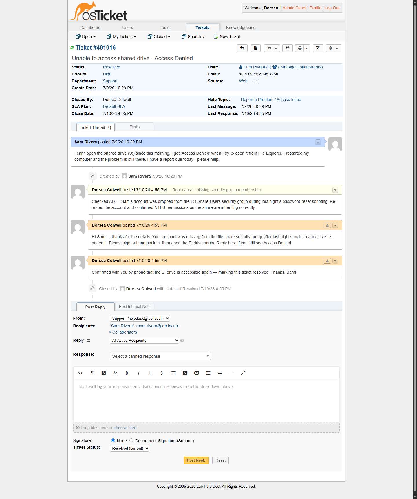
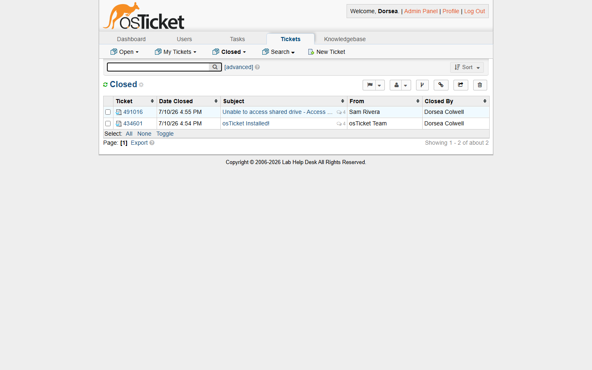

# osTicket — Ticket Lifecycle: Intake Through Resolution

This walkthrough follows a help desk ticket through its full lifecycle in [osTicket](https://osticket.com/), the open-source ticketing system — from the moment a user submits an issue to final resolution and closure. It builds on the environment set up in [osTicket — Prerequisites and Installation](https://github.com/DorseaColwell/osticket-prereqs).

> The screenshots below are from a full re-run of this lab on a local Windows 11 machine — osTicket v1.18.4 on Apache/MariaDB/PHP (XAMPP) — working a real ticket end to end as both the end user and the help desk agent.

## Environments and Technologies Used

- osTicket v1.18.4
- Apache, MariaDB, and PHP 8.2 (XAMPP stack)
- Windows 11 (local lab; the original course lab ran the same flow in an Azure VM)

## Ticket Lifecycle at a Glance

## Lifecycle Stages

### 1. Ticket Creation (Intake)

A user (here, *Sam Rivera*) submits a ticket through the client portal: contact information, a Help Topic that routes and prioritizes the request (*Report a Problem / Access Issue*), and a description of the issue — no access to a shared drive with a deadline looming.

osTicket assigns a unique ticket ID, sets the status to **New**, and confirms intake to the user:

### 2. Assignment and Initial Response

On the agent side, the ticket lands in the **Open** queue — unassigned, with a **High** priority inherited from its Help Topic:

Opening the ticket shows everything an agent needs for triage: status, priority, department, SLA plan with a due date, help topic, and the user's full message:

### 3. Working the Issue

The agent investigates and documents the root cause as an **internal note** — visible to staff only, so the full troubleshooting history stays on the ticket:

The agent then posts a **reply to the user** with the fix and next steps. Replying claims the ticket, so it's now assigned and every later action is attributed:

### 4. Resolution and Closure

After confirming the fix with the user, the agent posts a final reply and sets the ticket status to **Resolved**. The thread preserves the complete history — intake, internal note, replies, and the closing event with timestamps:

The ticket now appears in the **Closed** queue, a searchable record for future incidents and knowledge-base articles:

## Takeaways

Working tickets end-to-end in osTicket exercises the fundamentals of real help desk operations: triage and prioritization by business impact, SLA awareness, clear user communication, and disciplined documentation from intake to closure.
